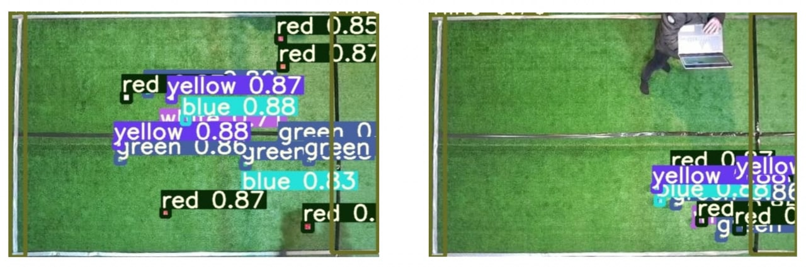
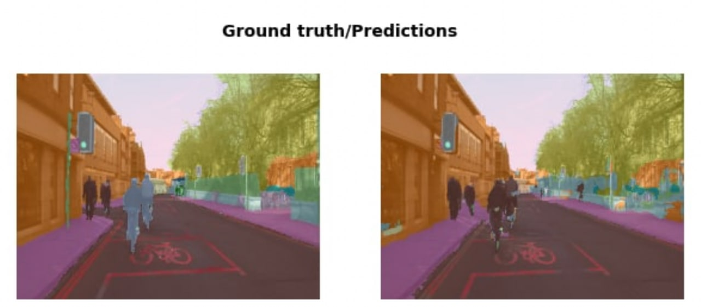

# ObjectDetection

## YOLOv5
We used the YOLOv5 to detect objects in a dataset from roboflow, the images below show two sample from test data after feeding to this network.

## Semantic Segmentation
In this part, a U-Net architecture is implemented to be used on CamVid dataset. The below image is the a pair that shows an input photo and the detected segments in the output.

